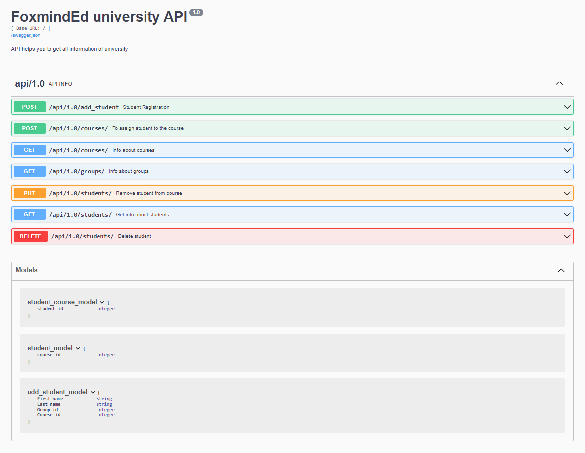

# The university database
___
### An application that inserts, select, updates, deletes data in the database using sqlalchemy and flask rest framework
:white_check_mark: CRUD is supported

:white_check_mark: API for application

:white_check_mark: Minimalistic front-end design

___

:one: To create and populate the database, run `upload_data_to_db.py`

Application in this file automatically generate 10 groups with randomly generated names. Each name  contain 2 characters, hyphen, 2 numbers.
Is taken 20 first names and 20 last names and randomly combine them to generate 200 students.
It's randomly assign students to groups. Each group could contain from 10 to 30 students.
Each student can be randomly assign to, from 1 to 3 courses.

:two: To run the application, run  file `routs.py`